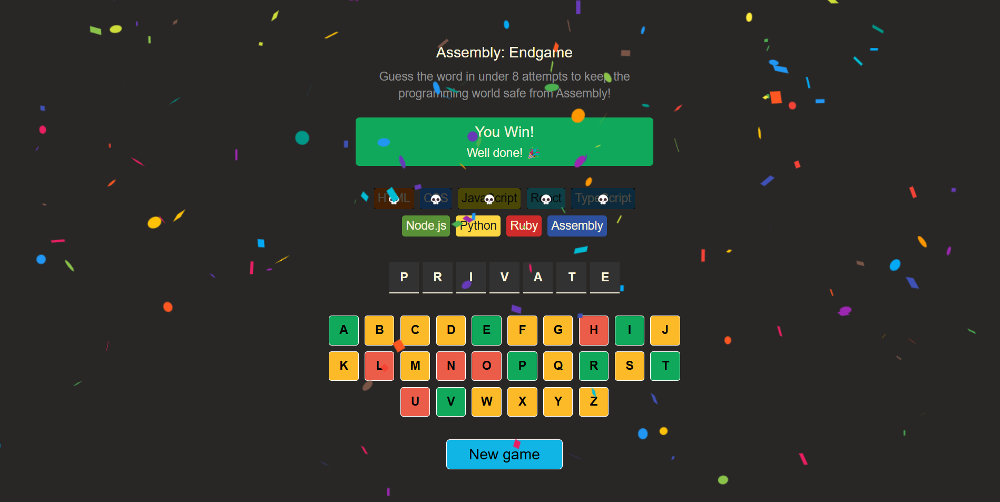

# Assembly: Endgame

Assembly: Endgame is a fun, interactive word-guessing game built using React. The goal is to guess the programming language in under 8 attempts to save the programming world from Assembly!

## Features

- **Interactive Gameplay**: Guess letters to reveal the hidden programming language.
- **Programming Theme**: Includes popular programming languages like JavaScript, Python, Ruby, and more.
- **Lives System**: You have up to 8 attempts to guess the correct word.
- **Responsive Design**: Works seamlessly on desktop and mobile devices.

## Screenshot



## How to Play

1. Open the game in your browser.
2. Click on letters to guess the hidden word.
3. You have 8 attempts. Correct guesses reveal the letters, and incorrect guesses reduce your remaining attempts.
4. Save the programming world by guessing the word before running out of attempts!

## Technologies Used

- **React**: For building the interactive frontend.
- **CSS**: For styling the game interface.

## Installation

1. Clone the repository:
   ```bash
   git clone https://github.com/chaitany233patil/Assembly-Endgame.git
   ```

2. Navigate to the project directory:
   ```bash
   cd assembly-endgame
   ```

3. Install dependencies:
   ```bash
   npm install
   ```

4. Start the development server:
   ```bash
   npm start
   ```

5. Open the game in your browser at `http://localhost:5173`.

## Deployment

The game is already deployed and accessible at: [Your Deployed URL](#)

## Future Enhancements

- Track the number of players and games played.
- Add a leaderboard to display top players.
- Introduce difficulty levels for advanced users.
- Include more programming languages and words.

Feel free to fork, contribute, or share feedback!
